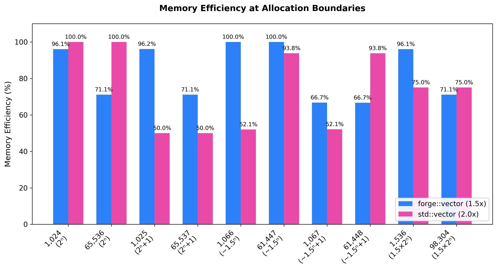

# Forge

Forge is a modern C++ data structures and algorithms library
focused on performance, correctness, and educational clarity. It is
designed to be well-documented, well-tested and well-benchmarked.

## Overview

- **Purpose:** A collection of hand-built data structures and algorithms
	implemented with a focus on performance, API ergonomics, and
	educational value.
- **Architecture:** Hybrid design. Core templated containers (like `vector`) are purely header-only, 
    while non-templated utilities and algorithms will be compiled into a static library.
- **Validation:** Fortified by a comprehensive Catch2 unit-test suite (ASan/UBSan enabled) and 
    aggressive Google Benchmark performance tracking.

---

## Current Ecosystem Status

Forge is under active development. Containers and algorithms are being rolled out incrementally:
| Component | Status | Documentation | Key Highlights |
| :--- | :--- | :--- | :--- |
| `forge::vector` | **Production Ready (v0.1.0)** | [`docs/design/vector.md`](docs/design/vector.md) | Contiguous memory layout, custom allocator integration. |
| `forge::deque` | In Development (v0.2.0) | Coming Soon | Chunked-sequence container with $O(1)$ front and back insertions. |

---

## Performance & Telemetry

Benchmarks live in [`benchmarks/`](benchmarks) and use highly focused workloads to compare Forge against the standard library.

Every core container in Forge includes a dedicated performance matrix tracking real-world engineering trade-offs, such as memory utilization boundaries and microarchitectural overheads.

### Example Profile: Data-Driven Design Invariants

Rather than relying on theoretical assumptions, design decisions (like choice of growth factors or safety paths) are backed by physical profiling data. Below is an example of the metrics documented:



---

## Example usage

Create a simple program using `forge::vector`:

```cpp
#include <forge/vector.hpp>
#include <iostream>

int main() {
		forge::vector<int> v;
		v.push_back(1);
		v.push_back(2);
		for (auto x : v) std::cout << x << '\n';
		return 0;
}
```

See [`examples/vector_example.cpp`](examples/vector_example.cpp) for a runnable example.

---

## Building & Testing

Forge uses a standard modern CMake workflow.

1. Configure the project:
```bash
mkdir -p build && cd build
cmake .. -DCMAKE_BUILD_TYPE=Release
```

2. Run the Runnable Example:

Build and run the showcase application demonstrating features like safe bounds 
checking, `std::span` integrations, and memory tracking:

```bash
cmake --build . --target forge_vector_example -j
./examples/forge_vector_example
```

3. Run the Unit Tests (Catch2):
```bash
cmake --build . --target forge_tests -j
ctest --output-on-failure
```

4. Run the Benchmarks (Google Benchmark):
```bash
cmake --build . --target forge_vector_benchmarks -j
./benchmarks/vector/forge_vector_benchmarks
```

---

## Documentation

- Design choices and performance documentation in [`docs/design`](docs/design)
- API reference and examples are generated to [`docs/generated`](docs/generated) using Doxygen.
- To regenerate docs locally, run the `doxygen` command from the
	project root (requires Doxygen installed).

---

## Roadmap & Upcoming Features

- v0.1.1: Add basic optimizations for trivial copy/destruct primitives.
- v0.2.0 Complete implementation of Double-Ended Queue (`forge::deque`).
- Future: Additional containers (`forge::hash_map`, `forge::list`, etc.) and an algorithm suite (`forge::sort`, `forge::binary_search`, etc.)

---

## License

This project is licensed under the MIT License — see the [LICENSE](LICENSE)
file for details.

---