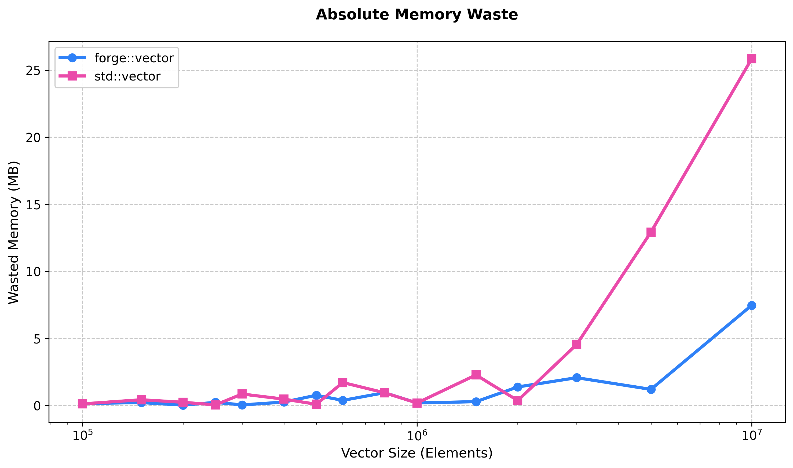
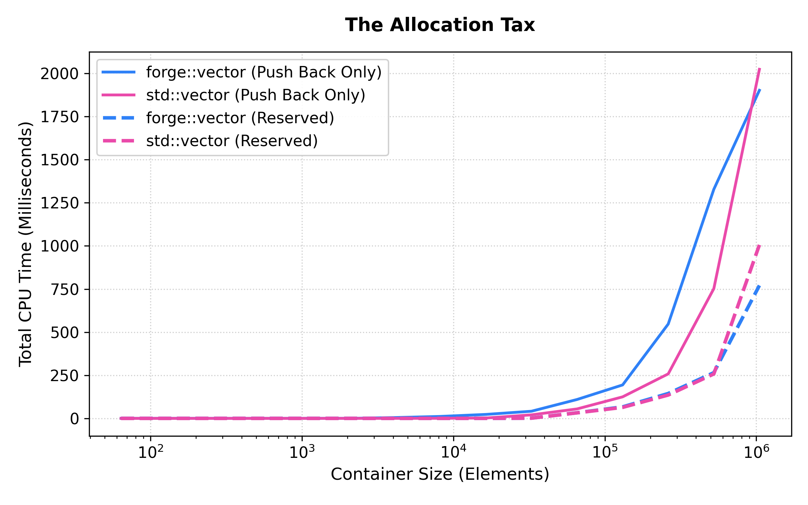
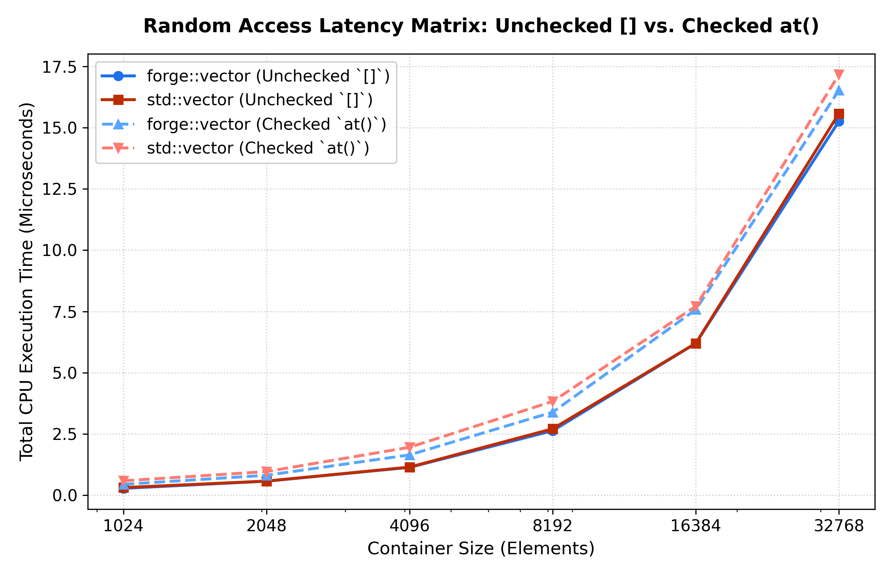

# Forge `vector` Design Notes

This document is the working design reference for `forge::vector`.

---

## 1. Executive Summary & Design Philosophy

`forge::vector` is a C++23 dynamic array built to be fast, predictable, and easy to reason about. The implementation favors contiguous storage, allocator-aware ownership, and straightforward iterator semantics so the container remains practical for production use.

### Core Objectives

- Preserve data locality through a contiguous backing buffer.
- Keep the public API close to the standard library for familiarity while adding a few developer-friendly extensions.
- Avoid unnecessary abstraction overhead in the common path.
- Stay strictly within modern C++23 facilities such as concepts, `std::span`, and `std::move_if_noexcept`.

### Non-Goals

- Backward compatibility with pre-C++20 standards.
- Treating every throwing move constructor as a performance-critical special case.
- Exposing internal storage details through the public API just to simplify testing.

### Extensions Beyond the STL

`forge::vector` adds a few quality-of-life APIs that are intentionally highlighted here because they matter to day-to-day ergonomics:

- `.contains()` for a direct boolean membership check.
- `.find()` for iterator-based lookup.
- `.memory_usage()` for quick storage telemetry.
- `.get_view()` for `std::span`-based, non-owning access.

These additions make the container feel more instrumented than a minimal STL clone without changing its core model.

---

## 2. Memory Architecture & Layout

The current implementation stores four pieces of state:

| Member | Responsibility |
| :--- | :--- |
| `alloc_` | Allocator instance used for all raw storage management. |
| `data_` | Pointer to the contiguous buffer that owns the elements. |
| `size_` | Number of constructed elements currently in use. |
| `capacity_` | Number of elements that can fit before reallocation is required. |

The declaration order is chosen for clarity and maintenance rather than because the compiler needs help with alignment. Alignment is handled automatically, but declaration order still matters because it determines construction and destruction order. Keeping allocator state next to raw storage state makes the ownership story easier to read and reduces the risk of subtle initialization mistakes.

### Growth Strategy

The container currently uses a 1.5x growth strategy in `reallocate()`:

- If capacity is zero, the first allocation grows to 1.
- Otherwise, the new capacity starts at `capacity_ + capacity_ / 2`.
- If integer truncation prevents growth, the implementation forces a +1 increase.

This is a deliberate compromise between memory overhead and reallocation frequency. A 1.5x growth factor tends to reuse freed pages more effectively after future allocations, while a 2x strategy is more aggressive and can strand larger freed blocks in allocator caches. The current design favors smoother allocator behavior and less wasted memory over raw expansion speed.

### Buffer Lifecycle

The important lifecycle phases are:

1. Allocate raw storage.
2. Construct elements into that storage.
3. Track the number of live elements in `size_`.
4. Destroy live elements on teardown or shrink operations.
5. Release raw storage once the elements are gone.

That sequence is reflected consistently across construction, `reserve()`, `resize()`, `insert()`, and destruction.

#### Hardening Against Self-Insertion Invalidation
In v0.1.1, the mutating pipeline is strictly hardened against self-insertion corruption (e.g., executing `vec.push_back(vec[0])` or `vec.emplace(vec.begin(), vec.back())`). 

If a capacity growth check triggers during a push/emplace action, the old backing buffer cannot simply be destroyed before object instantiation. Instead, the container leverages isolated helper state machines (`emplace_reallocate` and `insert_n`) to instantiate the incoming element directly into the **new** allocation *before* migrating existing elements or purging the old buffer. 

For in-place insertion mutations (where capacity is already sufficient but existing elements must be shifted downward), incoming elements are fully materialized into localized stack temporaries prior to tail-shifting mechanics. This completely prevents active memory layout adjustments from mutating or invalidating the user’s argument references midway through an operation.

---

## 3. Implementation Details & Algorithmic Complexity

The table below summarizes the main operations that matter most to users and benchmark comparisons.

| Operation | Complexity | Notes |
| :--- | :--- | :--- |
| `push_back()` | Amortized $O(1)$, worst-case $O(N)$ | Reallocation occurs when capacity is exhausted. |
| `emplace_back()` | Amortized $O(1)$, worst-case $O(N)$ | Constructs in place when possible. |
| `insert()` | $O(N)$ | Elements after the insertion point are shifted right. |
| `erase()` | $O(N)$ | Elements after the removal point are shifted left. |
| `at()` | $O(1)$ | Bounds-checked access with exception on invalid index. |
| `reserve()` | $O(N)$ if reallocation occurs | Copies or moves existing elements into a larger buffer. |
| `contains()` | $O(N)$ | Linear search with a boolean result. |
| `find()` | $O(N)$ | Linear search with iterator result. |
| `get_view()` | $O(1)$ | Non-owning `std::span` view. |

### Advanced C++23 Idiom: Deducing `this`

To eradicate structural code duplication across const and non-const method pairings, `forge::vector` replaces duplicated member boilerplate with C++23 **Explicit Object Parameters** (`this auto&& self`). 

Instead of generating split const/non-const functions for `operator[]`, `at()`, `front()`, `back()`, `data()`, `get_view()`, `find()`, `begin()`, and `end()`, a single template function automatically maps the element type qualifiers based on the value category and mutability of the calling object. This ensures that maintenance costs are halved, and fixes or contract additions applied to element access affect both mutable and immutable code paths identically.

### Code Consolidation: The Internal Helper Architecture
To preserve the DRY (Don't Repeat Yourself) principle, low-level iteration loops and shift patterns have been centralized into a robust suite of private helper routines such as:
- `emplace_reallocate(Args&&...)`: Isolated allocation path that safely captures arguments, provisions new heap blocks, constructs the incoming item, and then cleans up old storage.
- `insert_n(const_iterator pos, size_type count, FillGapFn&&, AppendFn&&)`: A highly generalized insertion engine. It manages the index math required for gap creation, coordinates rollback operations if copy/move actions throw, and executes the shift routines uniformly.
- `relocate_elements(pointer dst)`: tandardizes the movement of data arrays during reallocations.

### Custom-Allocator Aware Trivial Fast-Paths
The baseline implementation handles trivial type optimizations with a high degree of correctness. It does not blindly invoke `std::memcpy` or skip destructor iterations simply because `std::is_trivially_copyable_v<T>` evaluates to true.

If a user configures `forge::vector` with a highly specialized or stateful custom allocator that overrides `construct()` or `destroy()`, bypassing those routines would break custom behaviors like element tracking arenas or diagnostic logging pools.

To verify absolute safety, the library exposes sophisticated concept checks within forge::detail such as:
```cpp
template <typename T, typename Alloc>
inline constexpr bool trivially_manipulable_v =
    std::is_trivially_copyable_v<T> && 
    !allocator_has_custom_construct<Alloc, T> &&
    !allocator_has_custom_destroy<Alloc, T>;
```

When `trivially_manipulable_v` or `trivially_destructible_v` resolves to true at compile time, the container drops manual element-by-element tracking loops. During compilation, loops inside `reserve()`, `insert_n()`, `erase()`, and `resize()` collapse cleanly into `std::memcpy`, `std::memmove`, or zero-cost compile-time no-ops. If the allocator overrides construction or destruction traits, the container securely defaults to standard `std::allocator_traits` execution routines.

Additionally, runtime paths use C++20 branch prediction hints (`[[likely]]` / `[[unlikely]]`) on high-frequency paths—such as capacity verification checks and empty array boundary assertions—to ensure optimal CPU instruction pipelining.

### API Surface Notes

The following behaviors are especially relevant when updating the implementation:

- `operator[]` is intentionally unchecked.
- `at()` is the checked alternative and throws `std::out_of_range`.
- `front()` and `back()` are unchecked and assume the vector is non-empty.
- `data()` exposes the contiguous buffer for interoperability.
- `get_view()` is the preferred read/write view for algorithms that accept `std::span`.
- `contains()` and `find()` are linear-time convenience methods layered on top of the view API.

---

## 4. Advanced Testing & White-Box Architecture

Testing a container like this is a white-box problem as much as a black-box one. Public APIs can verify user-visible behavior, but they do not always expose enough internal state to validate capacity changes, reallocation behavior, or allocator-sensitive edge cases.

### The White-Box Testing Challenge

The hard part is verifying invariants such as:

- whether reallocation happened at the expected time,
- whether capacity changed correctly,
- whether a buffer move preserved the live element count,
- whether internal helper paths remain correct after refactors.

These checks are important, but they should not force debug-only internals into the production API.

### The Solution: `vector_tests_accessor`

The test suite uses a friend accessor hook to reach private helpers without polluting the public interface.

```cpp
template <typename> struct vector_tests_accessor;

template <typename T, typename Alloc = std::allocator<T>>
class vector {
	public:
		// ...

	private:
		template <typename>
		friend struct ::vector_tests_accessor;
};
```

In the test suite, that accessor is specialized to call helpers like `reallocate()` directly. This keeps production code clean while still allowing the tests to validate exact capacity transitions and allocator-state behavior.

The public API stays polished, and the tests still have full visibility into the container internals that matter.

### Sanitizer Integration

The test target is configured in CMake to compile with Address Sanitizer and Undefined Behavior Sanitizer on GNU/Clang toolchains:

- `-fsanitize=address,undefined`
- `-fno-omit-frame-pointer`
- debug-friendly compilation flags for better diagnostics

This is especially useful for a container implementation because reallocations, iterator invalidation, and destruction paths are exactly where memory bugs tend to hide.

---

## 5. Benchmarks & Empirical Telemetry

The benchmark suite is designed to compare `forge::vector` against the system `std::vector` under controlled workloads.

### Methodology

The current benchmark target is built with Release-style optimization flags in CMake:

- `-O3`
- `-march=native`
- `-DNDEBUG`
- `-fomit-frame-pointer`

The benchmark harness uses Google Benchmark, `benchmark::DoNotOptimize`, `benchmark::ClobberMemory`, and paused timing around setup steps so the measurements focus on the container behavior itself. The workloads in `benchmarks/vector/` cover construction, insertion, deletion, and access patterns.

### Performance Graphs

#### Memory Footprint & The Growth Factor

`forge::vector` utilizes a geometric growth factor of $1.5\times$, deliberately chosen over `std::vector`'s standard $2\times$ implementation (specifically `libstdc++` and `libc++`). 

While $2\times$ mathematically prevents the custom allocator from ever reusing previously freed memory pages, it also results in severe memory fragmentation. To prove this, we benchmarked the raw allocation byte-sizes at strict edge-case boundaries.


#### Analysis: The Boundary Trap
As shown above, `std::vector` achieves perfect 100% efficiency *exactly* at powers of 2. However, if a user pushes a single extra element ($N=65,537$), the capacity doubles to $131,072$. Efficiency immediately plummets to 50%. By utilizing a $1.5\times$ scale, `forge::vector` maintains a significantly tighter memory envelope only dropping to about 67% efficiency in its worse case memory overshoots.

When scaled to real-world datasets, this translates to massive absolute memory savings.



For a payload of 10,000,000 integers, `std::vector` wastes roughly **25.8 MB** of memory while the `forge::vector` reallocates more intelligently, capping the waste at roughly **7.4 MB**—an almost 3.5x improvement in heap pressure.

#### The Allocation Tax (Growth vs. Reserve)

Dynamic arrays guarantee Amortized $O(1)$ insertion, but the hidden constants behind dynamic reallocation can severely impact performance. Every time the vector exceeds its capacity, it must allocate a new memory block and move every existing element into the new block. 

To measure this "Allocation Tax", sequential insertions with no pre-allocation were benchmarked against sequential insertions into a perfectly pre-allocated buffer.



Utilizing `.reserve()` helps strips away the allocation tax, dropping the latency curve significantly. 

#### Runtime Safety Overhead (The "Safety Tax")

Modern container design demands a explicit balance between performance and deterministic safety guarantees. By default, the standard subscript operator (`operator[]`) omits bounds checking for maximum execution speed, while the `.at()` member function provides validation by throwing a `std::out_of_range` exception when an invalid index is specified.

To quantify the strict CPU execution penalty of this safety layer, a randomized lookup pass across the entire container range using both checked and unchecked access was benchmarked.



#### Analysis
As depicted in the benchmark matrix, the performance characteristics divide cleanly into two parallel lanes:

1. **The Baseline (`operator[]`):** When bounds checking is disabled, both `forge::vector` and `std::vector` display identical, tight microarchitectural traits. Because the elements are stored contiguously, the compiler can optimize the loop entirely into register arithmetic and zero-latency offset calculations.
2. **The Safety Tax (`.at()`):** When switching to checked `.at()`, both containers experience a measurable execution penalty. This upward shift maps the cost of the underlying assembly logic: a comparison instruction, a conditional branch instruction (`if (index >= size)`), and the stack frame overhead required to handle potential exception throws.

---

## 6. Future Enhancements / Technical Debt

### Short-Term Tracking Items

- Build out full reverse iterator support (`rbegin()`, `rend()`, `crbegin()`, `crend()`).

### Long-Term Architectural Explorations

- More aggressive optimizations using profiling tools.
- Reverse iterator support
- Additional container-wide policies that may be useful for future data structures.

---

## Appendix: API Snapshot

This snapshot is useful when scanning the header and updating the doc later.

- Constructors: default, allocator-aware, sized, fill, range, initializer-list, copy, move.
- Element access: `operator[]`, `at()`, `front()`, `back()`, `data()`, `get_view()`.
- Capacity: `size()`, `capacity()`, `empty()`, `max_size()`, `reserve()`, `shrink_to_fit()`, `memory_usage()`.
- Modifiers: `push_back()`, `emplace_back()`, `insert()`, `emplace()`, `pop_back()`, `erase()`, `resize()`, `clear()`, `assign()`, `swap()`.
- Lookup: `contains()`, `find()`.
- Iteration: `begin()`, `end()`, `cbegin()`, `cend()`.

Use this appendix as the quick checklist whenever the header changes.
